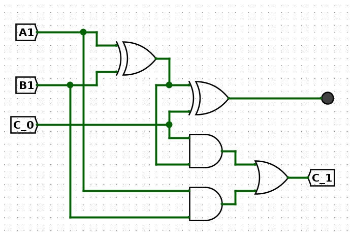
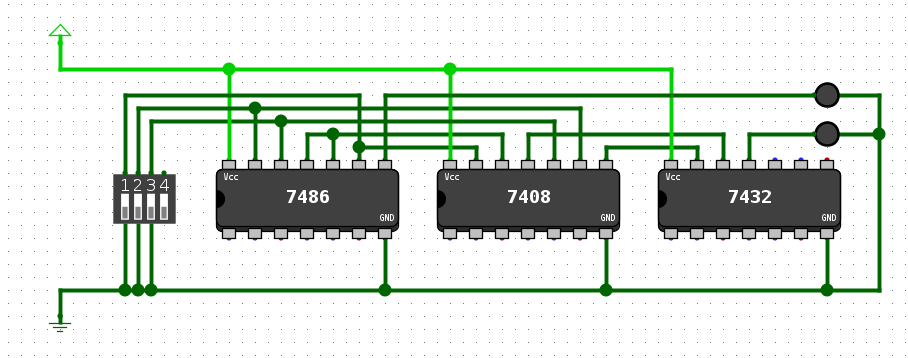
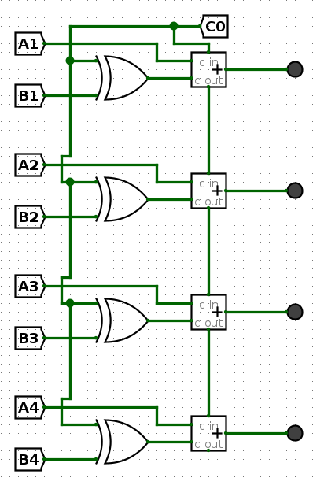
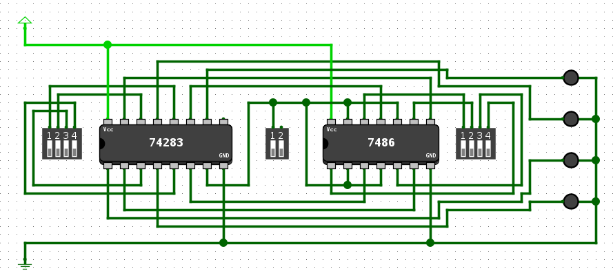
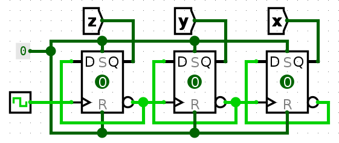
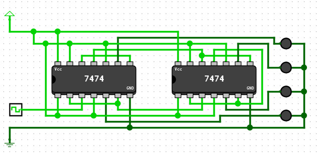
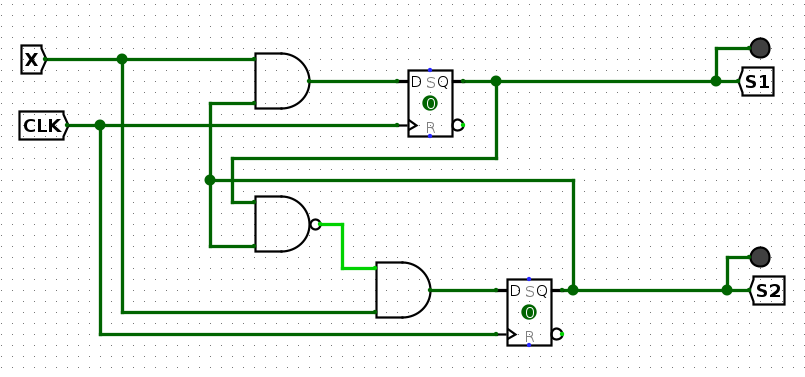
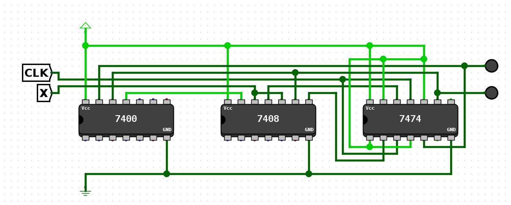

#### Q1

- Truth table

    | A | B | Ci | S | Co|
    | - | - | - | - | - |
    | 0 | 0 | 0 | 0 | 0 |
    | 0 | 1 | 0 | 1 | 0 |
    | 1 | 0 | 0 | 1 | 0 |
    | 1 | 1 | 0 | 0 | 1 |
    | 0 | 0 | 1 | 1 | 0 |
    | 0 | 1 | 1 | 0 | 1 |
    | 1 | 0 | 1 | 0 | 1 |
    | 1 | 1 | 1 | 1 | 1 |

- Logic diagram
    
    

- Application circuit
    
    

#### Q2
- logic_diagram 
    
    

- Application circuit
    
    

#### Q3
- logic_diagram 
    
    

- Application circuit
    
    

#### Q4
- logic_diagram 
    
    

- Application circuit
    
    
